# Deeproof: Privacy-Preserving Compliance Layer for RWA

**Version:** 2.0 (Draft)  
**Author:** Singgih  
**Focus:** Zero-Knowledge Identity, Inherited Trust, RWA Compliance.

---

## 1. Executive Summary

Deeproof is a decentralized compliance infrastructure that enables Real World Assets (RWA) and Web3 platforms to verify user KYC status without needing to view or store the user's personal data.

Using the **"Inherited Trust"** principle, Deeproof does not perform re-KYC. Instead, Deeproof mathematically proves that the user has passed KYC verification at trusted institutions (such as Binance, Coinbase, or GovID) through Zero-Knowledge protocols, ensuring user privacy remains intact (*Anonymous*) while still meeting regulatory standards (*Compliant*).

## 2. Problems & Solutions

### Current Problems
*   **KYC Redundancy:** Users have to upload ID cards and selfies repeatedly on every new RWA platform.
*   **Data Breach Risk:** Small RWA platforms often have weak database security, endangering sensitive user data (ID, Email, Address).
*   **Privacy vs Regulation:** Regulations demand clear identity, while the Web3 ethos demands privacy.

### Deeproof Solution
*   **Atomic Verification:** Verify once (at Binance/Bank), use anywhere.
*   **Zero Data Liability:** RWA platforms do not store personal data. They only store cryptographic proofs (*ZK Proof*).
*   **Selective Disclosure:** Users can prove "I am not a restricted citizen" or "I am over 18" without revealing their name or date of birth.

## 3. User Experience (UX) Flow

We eliminate the friction of using mobile apps or QR scans. Deeproof operates entirely as a Browser Extension.

1.  **Login Provider:** User logs into their Binance account (or other identity providers) on their desktop browser as usual.
2.  **Trigger Deeproof:** User opens the Deeproof Chrome Extension and clicks "Verify Identity".
3.  **Secure Fetching (Reclaim SDK):**
    *   The Extension opens a secure connection via Reclaim Protocol Witness (HTTPS Proxy).
    *   The system verifies the user's KYC status from the active Binance session seamlessly.
    *   User does not need to re-input username/password (leveraging active session/cookies if possible).
4.  **Proof Generation:** The user's browser generates a ZK Proof stating data validity.
5.  **On-Chain Binding:** User submits the proof to the Deeproof Smart Contract to bind their wallet address as a "Verified Human".

## 4. Technical Architecture (Low-Level)

Deeproof does not use a simple hashing scheme (`Hash(Email) == DB`). We use a high-privacy Identity Commitment Scheme standard (similar to Semaphore/Tornado Cash).

### A. Main Components
*   **Client (Extension):** ZK Logic, Reclaim SDK, Wallet Connect.
*   **Circuit (Circom):** Mathematical proof logic.
*   **Smart Contract:** Merkle Tree Storage & Verification.

### B. System Architecture Diagram

### C. User Flow Sequence

### D. Data Flow & Cryptography

#### Step 1: Identity Creation (Client Side)
When data from Reclaim is valid, the Extension generates two secret random numbers:
*   **Nullifier:** Unique key to prevent double-spending (double claims).
*   **Trapdoor:** User's secret key.

The system creates an Identity Commitment:
$$Commitment = Poseidon(Nullifier, Trapdoor)$$

#### Step 2: Merkle Tree Registration (On-Chain)
The Commitment is sent to the Smart Contract and inserted into the Merkle Tree.
> **Note:** The Contract does not know the user's email. The Contract only knows there is "one valid new commitment".

#### Step 3: Verification / Login RWA (Client Side)
When a user wants to log in to an RWA platform:
1.  User downloads the Merkle Path from the contract.
2.  User creates a ZK Proof in the Extension (locally) with inputs:
    *   **Private Inputs:** Nullifier, Trapdoor, Merkle Path.
    *   **Public Inputs:** Merkle Root, External Nullifier (RWA Platform ID).
3.  **Circuit Logic:**
    *   Proves that the user possesses the Nullifier & Trapdoor whose hash exists inside the Merkle Tree (Valid Member).
    *   Generates a unique hash for that RWA platform (so the user cannot be tracked across platforms).

### E. Cryptographic Process Diagram

```mermaid
flowchart LR
    subgraph Input["Private Inputs"]
        UID["userId"]
        TRAP["trapdoor"]
        KYC["userKycLevel"]
    end

    subgraph Public["Public Input"]
        MIN["minKycLevel = 2"]
    end

    subgraph Circuit["Circom Circuit"]
        CONSTRAINT["KYC Level Check"]
        POSEIDON["Poseidon Hash"]
    end

    subgraph Output["Proof Output"]
        COMMIT["identityCommitment"]
        PROOF["π (ZK Proof)"]
    end

    UID --> POSEIDON
    TRAP --> POSEIDON
    KYC --> CONSTRAINT
    MIN --> CONSTRAINT
    CONSTRAINT -->|"kycLevel == minKycLevel"| POSEIDON
    POSEIDON --> COMMIT
    COMMIT --> PROOF
```

### F. Extension Communication Flow

## 5. Technology Stack

*   **Browser Extension:** React / Plasmo Framework.
*   **Data Fetching:** Reclaim Protocol (JS Web SDK - HTTP Proxy Mode).
*   **ZK Circuits:** Circom (Language), SnarkJS (Prover/Verifier).
*   **Cryptography:** Poseidon Hash (ZK-friendly hashing).
*   **Smart Contract:** Solidity (On-chain storage & Verifier).

## 6. Compliance Model

### "Inherited Trust Model"
Deeproof acts as a trust bridge.
*   **RWA Platform:** Does not need to perform KYC themselves.
*   **Regulator:** Accepts proof that the user has passed AML/KYC screening at a regulated institution (Binance/Bank).

### Additional Security Features
*   **Anti-Sybil:** One Binance account = One Deeproof Identity (guaranteed by Nullifier).
*   **Escrowed Identity (Optional/Roadmap):** Identity data encryption option with a regulator key (only opened if there is a court/legal warrant).